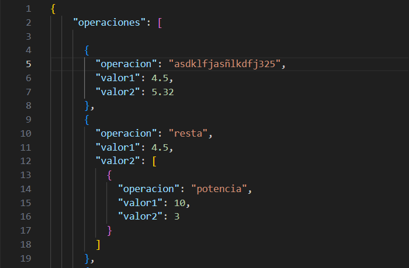
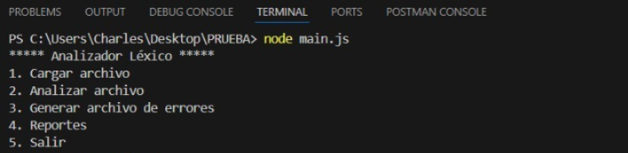

# Manual de Usuario - Analizador Léxico 

## Indice
1. Nombre del programa
2. Descripcion
3. Requisitos del sistema
4. Instalacion
5. Funcionamiento
6. Menu principal
7. Uso de las funciones
- Cargar Archivo
- Analizar Archivo
- Generar Archivo de Errores
- Generar Reportes
- Salir
8. Ilustraciones

# Descripcion

Bienvenido al Analizador Lexico, una herramienta diseñada para realizar de una forma rapida y comoda analisis lexicos de archivos JSON. Este programa te permite generar reportes y es capaz de identificar errores en operaciones definidas dentro de los archivos utilizados.

## Requisitos del Sistema

- Contar con Node.js instalado.
- Sistema operativo libre.
- Memoria RAM 4GB o superior.
- Archivos JSON con operaciones.

## Instalacion

- Cerciorarse de contar con las dependencias "readline, path, fs" para su correcto funcionamiento.
- Contar con los archivos necesarios en el equipo que vayamos a utilizar.

## Funcionamiento 

- Abrir Visual Studio Code
- Abrir una terminal
- Debemos dirigirnos a la ubicacion del archivo (main.js)
- Dentro de la terminal ejecutar el siguiente comando: **node main.js**

## Menu Principal

El menu principal cuenta con las siguientes opciones las cuales se mostraran al momento de ejecutarlo:

1. **Cargar archivo**
- Esta funcion es la encargada de cargar a los archivos JSON utilizando una ruta a la carpeta de Archivos dentro del directorio utilizado.

2. **Analizar archivo**
- Nos muestra los archivos en la carpeta "Archivos".
- Selecciona un archivo para analizar 
- Se representan las operaciones realizadas de manera grafica generando un archivo .dot.

3. **Generar archivo errores**
- Se encarga del analisis de archivos JSON mostrando asi los errores detectados.
- En la carpeta "Errores" se crean archivos JSON detallando los errores detectados.

4. **Reportes**
- Se encarga de generar reportes lexicos en formato HTML de los archivos JSON.
-  El reporte arroja una tabla la cual incluye informacion sobre lexemas, tipo, y las posiciones en las filas y columnas.

5. **Salir**
- Esta opcion finaliza el programa.

## Uso de las Funciones

1. **Cargar Archivo**
- Pulse la opcion 1 en el menu principal.
- Debes de introducir la ruta donde se encuentra el archivo JSON.
- El archivo se copiara a la carpeta archivos.

2. **Analizar Archivo**
- Pulse la opcion 2 en el menu principal.
- El analizador nos mostrara una lista de archivos JSON en la carpeta Archivos.
- Debe de ingresar el archivo a analizar.
- El analizador generara un archio (.dot) en la carpeta Reportes.

3. **Generar Archivo de Errores**
- Pulse la opcion 3 en el menu pricipal.
- El programa se encargara de analizar los archivos JSON y generara un archivo (errores.json) el cual ira ubicado en la carpeta errores si se detectan errores.

4. **Generar Reportes**
- Pulse la opcion 4 en el menu principal
- El analizador generara un reporte en formato HTML llamado (reporte_lexico.html) en la carpeta REPORTES.

5. **Salir** 
- Pulse la opcion 5 en el menu principal para cerrar el programa.

## Estructura del Archivo JSON
![Estructura JSON] ()

## Estructura del menu 
![Menu] ()

